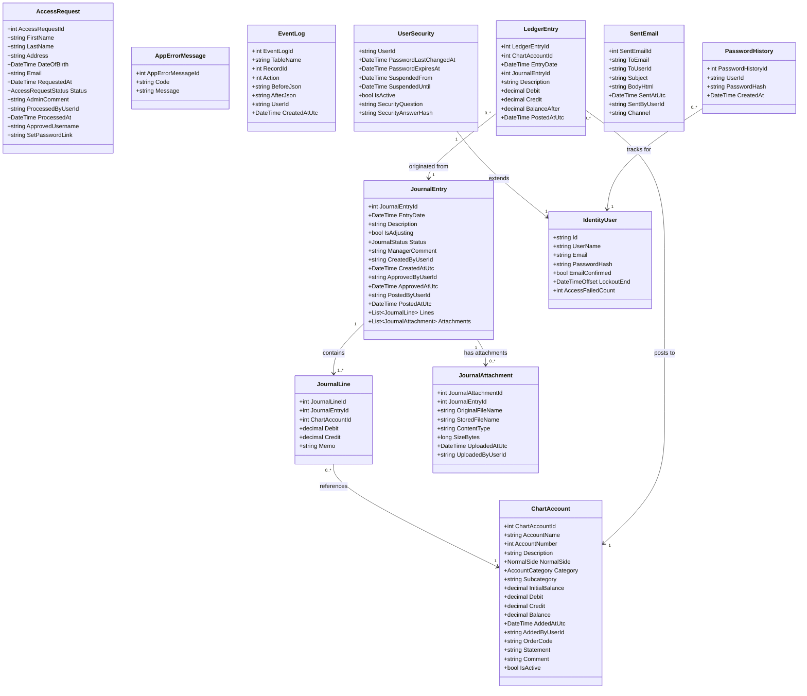
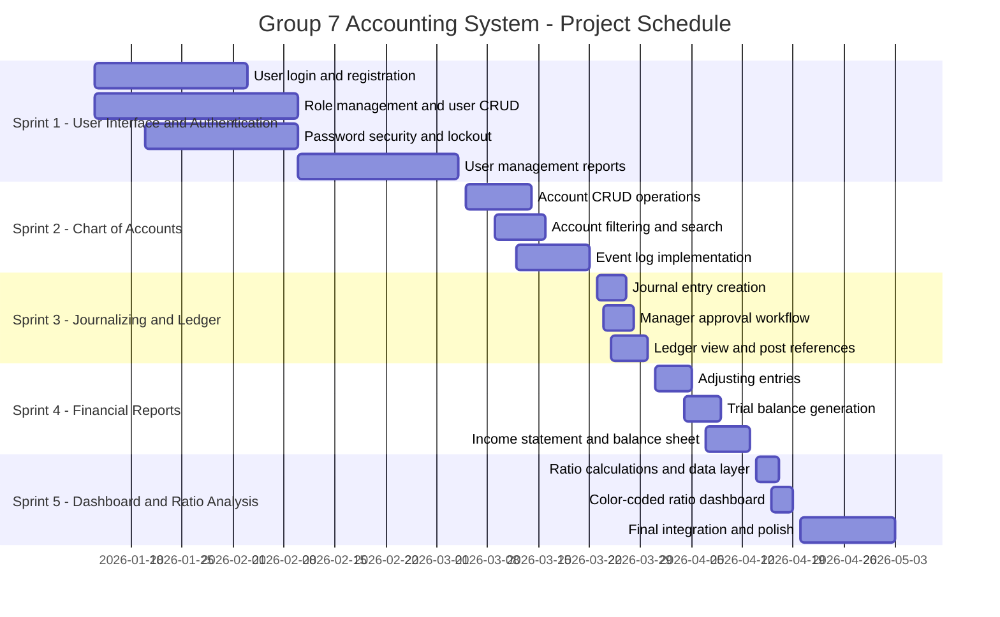

# Project Proposal: AccountingSystem - Group 7 Accounting System

**Course:** SWE4713 - Software Engineering
**Team:** Group 7
**Date:** May 3, 2026
**Submitted To:** Dr. Jerry Mamo

---

## 1.1 Title

**AccountingSystem - Group 7 Accounting System (SWE4713)**

The official application name is "AccountingSystem," as displayed in the navigation bar brand text and page title across all screens of the application.

---

## 1.2 Motivation

Modern small-to-medium businesses require reliable, secure, and accessible accounting systems to manage their financial operations. While enterprise solutions such as QuickBooks and Sage exist, they are often prohibitively expensive or overly complex for smaller organizations. There is a clear gap for a streamlined, web-based accounting tool that provides essential functionality - chart of accounts management, journal entry workflows, ledger tracking, and financial reporting - without the overhead of a full enterprise platform.

This project was undertaken as part of the SWE4713 Software Engineering course to apply software engineering principles to a real-world domain. The team sought to demonstrate competency in requirements gathering, system design, iterative development, testing, and documentation by building a fully functional accounting application from scratch. The project follows a structured sprint-based methodology that mirrors industry Agile practices.

The team chose the accounting domain because it offers rich opportunities to demonstrate full-stack web development, role-based security, complex business logic (debit/credit balancing, approval workflows, ledger posting), and data integrity constraints. Building this system required the team to acquire accounting domain knowledge alongside technical skills, resulting in a project that is both educationally rigorous and practically useful.

---

## 1.3 Statement of the Problem or Need

**Problem Statement:** Small-to-medium businesses and educational institutions need a secure, role-based, web-accessible accounting system that enforces proper accounting procedures, provides audit trails, and generates accurate financial reports - without requiring expensive commercial software licenses.

**Specific Problems and Needs Addressed:**

1. Businesses need a centralized, web-based accounting system accessible from any device with a browser, eliminating the need for locally installed software.
2. Manual accounting processes are error-prone; the system must enforce that debits equal credits before any journal entry can be submitted.
3. Organizations require role-based access control so that only authorized personnel can perform sensitive operations such as adding accounts or approving transactions.
4. There is a need for a formal journal entry approval workflow where accountants submit entries and managers review, approve, or reject them with documented reasons.
5. Approved journal entries must be automatically posted to the general ledger with correct balance calculations, reducing the risk of posting errors.
6. Administrators need comprehensive user management capabilities including account creation, role assignment, activation/deactivation, and temporary suspension.
7. Password security must be enforced through complexity requirements, expiration policies, history tracking (preventing reuse), and account lockout after failed attempts.
8. An audit trail (event log) is required to record every data change with before-and-after snapshots, user identification, and timestamps for accountability and compliance.
9. The chart of accounts must prevent duplicate account numbers and names, enforce integer-only account numbers, and prohibit deactivation of accounts with non-zero balances.
10. Financial reports (trial balance, income statement, balance sheet, retained earnings statement) must be generated dynamically from the ledger data for any given date range.
11. A dashboard with financial ratio analysis and color-coded health indicators is needed to provide at-a-glance organizational financial health assessment.
12. The system must support document attachments on journal entries (PDF, Word, Excel, CSV, images) for source documentation and audit support.

---

## 1.4 Objectives

1. **Role-Based Access Control:** Implement three distinct user roles - Administrator, Manager, and Accountant - each with specific permissions enforced at the page level using ASP.NET Identity authorization attributes.
2. **User Management:** Enable administrators to create users (with auto-generated usernames), assign roles, activate/deactivate accounts, suspend users for specified date ranges, and view user reports.
3. **Secure Authentication:** Enforce password complexity (minimum 8 characters, must start with a letter, must contain a digit and special character), password expiration (90 days), password history (prevent reuse of last 5 passwords), and account lockout after 3 failed attempts.
4. **Access Request Workflow:** Allow prospective users to request access through a public form; administrators review, approve (generating a username and temporary password), or reject (with a required comment) each request.
5. **Chart of Accounts Management:** Implement full CRUD operations for chart of accounts (administrator only) with validation against duplicate names/numbers, integer-only account numbers, and prevention of deactivating accounts with positive balances.
6. **Journal Entry System:** Allow managers and accountants to create multi-line journal entries with debit/credit balance enforcement, account selection from active chart of accounts, optional memo fields, and file attachment support.
7. **Approval Workflow:** Implement a manager-only approval/rejection workflow for journal entries, requiring a comment on rejections, with status tracking (Pending, Approved, Rejected, Posted).
8. **Ledger Posting:** Automatically create ledger entries when approved journal entries are posted, calculating running balances using proper accounting math (normal side impact), and updating account totals.
9. **Event Logging:** Record every data modification across all tables with before/after JSON snapshots, user ID, timestamp, and action type for complete audit trail capability.
10. **Financial Report Generation:** Generate trial balance, income statement, balance sheet, and retained earnings statement from account balance data, with CSV export, browser print, and email-to-outbox options. (Partially implemented - all four report pages are functional; date range filtering UI is present but filtering logic is not applied to queries in the final submission.)
11. **Dashboard with Notifications:** Provide a role-aware dashboard showing pending approval counts, rejected entry counts, and approved-not-yet-posted counts for quick status assessment. (Completed.)
12. **Financial Ratio Dashboard:** Display financial ratios on the landing page with color-coded indicators (green/yellow/red) showing organizational financial health at a glance. (Deferred - not included in final submission. The notification dashboard is implemented; ratio calculations are not.)

---

## 1.5 Methodology

### Development Approach

The project follows an Agile/Scrum methodology with five defined sprints, each targeting a specific functional module of the accounting system. Each sprint builds incrementally on the previous one, producing a working, integrated software increment at the end of each cycle. The team prioritized delivering functional software at the end of each sprint rather than deferring integration to the final phase.

### Task Division and Sprint Structure

Work was divided across five sprints aligned to logical modules of the system:
- **Sprint 1 - User Interface and Authentication:** Login/registration, role management, password security policies, user management, and email notification infrastructure.
- **Sprint 2 - Chart of Accounts:** Account CRUD operations, duplicate prevention, deactivation rules, search/filter functionality, and event logging.
- **Sprint 3 - Journalizing and Ledger:** Journal entry creation with debit/credit balancing, manager approval workflow, ledger posting with running balances, and post reference navigation.
- **Sprint 4 - Adjusting Entries and Financial Reports:** Adjusting entries, trial balance generation, income statement, balance sheet, and retained earnings statement.
- **Sprint 5 - Dashboard and Ratio Analysis:** Financial ratio calculations, color-coded dashboard indicators, and final system integration and testing.

### Progress Tracking and Version Control

The team uses Git and GitHub for version control, with the repository named "AD-AccountingSystem-Group7." Development follows a direct-push strategy to the master branch after verifying successful compilation. This approach was chosen for simplicity given the team size. Database migrations are committed alongside feature code to maintain schema consistency.

### Meetings and Communication

The team holds weekly meetings to review progress, coordinate sprint work, and resolve blockers. Primary communication channels are GroupMe for quick day-to-day coordination and Microsoft Teams for structured meetings and file sharing.

### Tools Used

- .NET 8 SDK and C# 12
- ASP.NET Core 8.0 Razor Pages
- Entity Framework Core 8.0 (ORM)
- ASP.NET Identity (authentication and authorization)
- SQL Server (LocalDB for development, SQL Server for production)
- SQLite (alternative local development on macOS)
- Visual Studio / Visual Studio Code (IDE)
- Git and GitHub (version control)
- Bootstrap 5 (CSS framework)
- jQuery and jQuery Validation (client-side scripting and validation)

### Documents Produced

- Project Proposal (this document)
- Software Project Management Plan (SPMP)
- Software Requirements Specification (SRS)
- Software Design and Testing Document (SDT)
- User Manual

### Milestones

| Milestone | Description | Target Sprint |
|-----------|-------------|---------------|
| M1 | Authentication, role management, and user management complete | Sprint 1 |
| M2 | Chart of accounts fully operational with event logging | Sprint 2 |
| M3 | Journal entry creation, approval workflow, and ledger posting complete | Sprint 3 |
| M4 | Adjusting entries and all financial reports generating correctly | Sprint 4 |
| M5 | Financial ratio dashboard and final integration complete | Sprint 5 |

---

## 1.6 Knowledge Areas Needed for the Project

- **C# and .NET 8:** The primary programming language and runtime for all server-side logic, page models, services, and data access layers.
- **ASP.NET Core Razor Pages:** The web framework used for rendering all HTML views and handling HTTP requests through the Page Model pattern (one .cshtml view + one .cshtml.cs handler per screen).
- **Entity Framework Core:** The Object-Relational Mapper (ORM) used for all database operations, including migrations, LINQ queries, and change tracking across all model entities.
- **ASP.NET Identity:** The authentication and authorization framework managing user registration, login, password hashing, role assignment, account lockout, and the [Authorize] attribute system.
- **SQL / Database Design:** Knowledge of relational database schema design, primary and foreign key relationships, indexing, and writing efficient queries through EF Core's LINQ interface.
- **HTML / CSS / JavaScript:** Frontend technologies used for page layout (Bootstrap 5 grid system), form design, client-side validation (jQuery Validation), and interactive elements (dropdowns, dynamic form rows).
- **Accounting Domain Knowledge:** Understanding of chart of accounts structure, debit/credit mechanics, normal sides, journal entry workflows, ledger posting, trial balance preparation, financial statement generation (income statement, balance sheet, retained earnings), and financial ratio analysis.
- **Git / GitHub:** Version control fundamentals including committing, pushing, branching, and managing a shared repository for collaborative development.
- **Security Best Practices:** Knowledge of password hashing (PBKDF2), anti-forgery token protection (CSRF prevention), input validation, and role-based authorization patterns.
- **Bootstrap 5 (CSS Framework):** The responsive CSS framework used for page layout, navigation components, cards, alerts, form styling, and the grid system that provides consistent spacing and mobile-friendly design.
- **File Upload Handling:** Server-side file validation, storage management, and MIME type verification for journal entry source document attachments (PDF, Word, Excel, CSV, and image formats).

---

## 1.7 Project Deliverables and Beneficiaries

### Deliverables

| Deliverable | Description | Format |
|-------------|-------------|--------|
| Working web application | Fully functional multi-role accounting system accessible via browser | ASP.NET Core 8 web application |
| Source code | Complete, organized codebase following Razor Pages conventions | GitHub repository (AD-AccountingSystem-Group7) |
| Project Proposal | Project scope, objectives, methodology, and schedule | Markdown |
| SPMP | Software Project Management Plan with team structure, risks, and sprint plans | Markdown |
| SRS | Software Requirements Specification with all functional and non-functional requirements | Markdown |
| SDT | Software Design and Testing document with architecture, database design, and test cases | Markdown |
| User Manual | End-user guide for all three roles (Administrator, Manager, Accountant) | Markdown |
| Oral Presentation and Live Demo | A 15-minute team presentation covering the project proposal, architecture, and live demonstration of the working application | With PowerPoint slides |

### Beneficiaries

- **Small-to-medium businesses** needing an affordable, web-based accounting solution with proper internal controls
- **Accounting professionals** (Administrators, Managers, Accountants) who will use the system for daily financial operations
- **The course instructor** evaluating the software engineering process, documentation quality, and technical implementation
- **Future developers** who may extend or maintain the system, benefiting from clean code organization and comprehensive documentation
- **The student team** - gaining practical experience in full-stack development, security implementation, accounting domain modeling, and collaborative software engineering

---

## 1.8 History

Accounting software has evolved significantly over the past several decades. Early desktop applications like Peachtree (now Sage 50) and QuickBooks established the standard feature set for small business accounting: chart of accounts management, journal entries, ledger posting, and financial statement generation. More recently, cloud-based platforms such as FreshBooks, Wave, and Xero have made accounting tools accessible through web browsers, reducing the need for local installation and enabling real-time multi-user collaboration.

This project draws inspiration from these established tools in several key ways. Like commercial accounting software, it provides a structured chart of accounts with categorization, a journal entry system with debit/credit balancing, a general ledger with running balances and post references, and financial statement generation. The role-based access model (Administrator, Manager, Accountant) mirrors the separation of duties found in real organizations, where different personnel have different levels of authority over financial data.

What makes this project distinct is its purpose and design context. Built as an academic project for SWE4713 Software Engineering, it demonstrates the full software development lifecycle - from requirements specification through design, implementation, testing, and documentation. The technology stack (ASP.NET Core 8, Entity Framework Core, ASP.NET Identity) represents modern Microsoft web development practices. Several features go beyond what simpler academic projects typically include: the event logging system with JSON before/after snapshots, the access request approval workflow, password history tracking to prevent reuse, security question-based password recovery, and the email outbox pattern for tracking all system-generated communications. These features reflect real-world requirements for audit compliance and security that commercial tools must also address.

---

## 1.9 Proprietary Information and Confidentiality Requirements

- The source code for this application is the intellectual property of Group 7 and Kennesaw State University, developed as part of the SWE4713 Software Engineering course.
- No real client financial data is used anywhere in the system. All test data, including user accounts, chart of accounts entries, and journal transactions, is fabricated for demonstration and testing purposes.
- The application handles sensitive authentication credentials. All passwords are encrypted using ASP.NET Identity's built-in PBKDF2 with HMAC-SHA256 password hashing. Security question answers are hashed using SHA-256 before storage.
- The database contains user account information (usernames, email addresses, hashed passwords) which should be treated as confidential in any production deployment.
- The default administrator account credentials (admin@local.test / Admin!234) seeded in the database are intended for development only and must be changed before any production deployment.
- The source code is stored in a public GitHub repository at https://github.com/thespeedkarter/AD-AccountingSystem-Group7.

---

## 1.10 Required Facilities

| Facility / Tool | Purpose | Notes |
|-----------------|---------|-------|
| Computer with .NET 8 SDK | Development and build environment | Windows (recommended) or macOS |
| Visual Studio 2022 or Visual Studio Code | Integrated development environment | Visual Studio recommended for full Razor Pages tooling |
| Git / GitHub | Version control and collaboration | Repository: AD-AccountingSystem-Group7 |
| SQL Server LocalDB | Primary development database | Included with Visual Studio on Windows |
| SQLite | Alternative local database | For macOS development environments |
| Web browser | Testing, debugging, and end-user access | Chrome (recommended), Firefox, Edge, Safari |
| Internet connection | GitHub access, NuGet package restoration | Required during development and deployment |
| SMTP email service | Password recovery and notification emails | Custom database-backed email sender (DbEmailSender) - production SMTP configuration required for email delivery |
| Cloudflare Tunnel | Application hosting and public access | Used via trycloudflare.com to expose the local development server for demonstration and grading |

---

## 1.11 Project Assumptions and Constraints

### Assumptions

- Users have access to a modern web browser (Chrome 100+, Firefox 100+, Edge 100+, Safari 15+) and a stable internet connection.
- The server running the application has the .NET 8 runtime installed and is configured to run ASP.NET Core applications.
- Users have basic computer literacy and can navigate web forms, click buttons, and enter data into text fields.
- All financial data entered by users is assumed to be accurate; the system validates format and balance but not the business truthfulness of transactions.
- Email functionality assumes a configured SMTP server is available for production deployment. During development, emails are stored in the database outbox table (SentEmails) rather than being sent externally.
- The system will be used by a small-to-medium number of concurrent users (not designed for enterprise-scale load).
- The system assumes at least one Administrator account exists in the database, seeded automatically at application startup via the SeedRolesAndAdminAsync method in Program.cs.
- Uploaded source documents are stored on the server file system under wwwroot/uploads/ and the application assumes sufficient disk space is available.
- The database schema is applied via Entity Framework Core migrations. The server environment is assumed to have migration tooling or a pre-migrated database available.
- The three roles (Administrator, Manager, Accountant) are seeded on first startup and are not expected to be modified or extended at runtime.

### Constraints

- Passwords must be a minimum of 8 characters, must start with a letter, must contain at least one digit and one special character.
- Passwords expire after 90 days; users receive a warning when 3 or fewer days remain before expiration.
- The last 5 passwords cannot be reused (enforced via password history tracking).
- A maximum of 3 failed login attempts results in account lockout for 30 minutes.
- Total debits must equal total credits before a journal entry can be submitted.
- Accounts cannot be permanently deleted from the chart of accounts - they can only be deactivated.
- Accounts with a balance greater than zero cannot be deactivated.
- Account numbers must be integers only (no decimals, no letters).
- No duplicate account numbers or account names are allowed in the chart of accounts.
- Only administrators can add or edit accounts in the chart of accounts; managers and accountants have view-only access.
- Only managers can approve or reject journal entries.
- Journal entries cannot be edited or deleted once submitted - they can only be approved, rejected, or posted.
- Rejected journal entries include a mandatory manager comment explaining the reason for rejection.
- Only approved journal entries can be posted to the ledger.
- File uploads on journal entries are limited to 25 MB per file and restricted to the following types: PDF, DOC, DOCX, XLS, XLSX, CSV, JPG, JPEG, PNG.
- SQL Server is required for production deployment; SQLite is supported for local macOS development only.
- Journal entry descriptions are limited to 200 characters; manager rejection comments are limited to 500 characters.
- Account names are limited to 120 characters; account descriptions and comments are limited to 500 characters each.
- The order code field on chart of accounts entries is limited to 10 characters; the statement field is limited to 5 characters (IS, BS, or RE).
- Security question text is limited to 200 characters and the hashed answer to 128 characters.

---

## 1.12 Major Stakeholders

| Stakeholder | Role | Interest / Expectation |
|-------------|------|------------------------|
| Dr. Jerry Mamo | Course Instructor | Project evaluation and grading against SWE4713 requirements |
| Alejandro Garcia Soto | Developer - Group 7 | Successful delivery of a functional, well-documented accounting system |
| Wilfred Faltz | Developer - Group 7 | Successful delivery of a functional, well-documented accounting system |
| Seth Venable | Developer - Group 7 | Successful delivery of a functional, well-documented accounting system |
| Landon Clark | Developer - Group 7 | Successful delivery of a functional, well-documented accounting system |
| Luke Odom | Developer - Group 7 | Successful delivery of a functional, well-documented accounting system |
| Administrator users | System admin role | Manage users, maintain chart of accounts, oversee system operations and audit logs |
| Manager users | Financial oversight role | Approve/reject journal entries, post to ledger, generate financial reports |
| Accountant users | Day-to-day accounting role | Create journal entries, attach source documents, view ledger and reports |
| Kennesaw State University | Academic institution | Educational value and quality of the project |

---

## 1.13 Class Diagram

The class diagram below shows the primary model classes in the system and their relationships, as extracted from the /Models/ directory of the ASP.NET Core project.



Note: For a higher-resolution or interactive version of this diagram, see the SDT document.

---

## 1.14 Database Diagram

The entity relationship diagram below shows all database tables and their relationships, as reflected in the Entity Framework Core DbContext and model classes.

```mermaid
erDiagram
    AspNetUsers {
        string Id PK
        string UserName
        string NormalizedUserName
        string Email
        string NormalizedEmail
        bool EmailConfirmed
        string PasswordHash
        string SecurityStamp
        string ConcurrencyStamp
        string PhoneNumber
        bool PhoneNumberConfirmed
        bool TwoFactorEnabled
        datetimeoffset LockoutEnd
        bool LockoutEnabled
        int AccessFailedCount
    }

    AspNetRoles {
        string Id PK
        string Name
        string NormalizedName
        string ConcurrencyStamp
    }

    AspNetUserRoles {
        string UserId PK_FK
        string RoleId PK_FK
    }

    UserSecurities {
        string UserId PK_FK
        datetime2 PasswordLastChangedAt
        datetime2 PasswordExpiresAt
        datetime2 SuspendedFrom
        datetime2 SuspendedUntil
        bit IsActive
        nvarchar SecurityQuestion
        nvarchar SecurityAnswerHash
    }

    PasswordHistories {
        int PasswordHistoryId PK
        string UserId FK
        string PasswordHash
        datetime2 CreatedAt
    }

    AccessRequests {
        int AccessRequestId PK
        nvarchar FirstName
        nvarchar LastName
        nvarchar Address
        datetime2 DateOfBirth
        nvarchar Email
        datetime2 RequestedAt
        int Status
        nvarchar AdminComment
        nvarchar ProcessedByUserId
        datetime2 ProcessedAt
        nvarchar ApprovedUsername
        nvarchar SetPasswordLink
    }

    ChartAccounts {
        int ChartAccountId PK
        nvarchar AccountName
        int AccountNumber
        nvarchar Description
        int NormalSide
        int Category
        nvarchar Subcategory
        decimal InitialBalance
        decimal Debit
        decimal Credit
        decimal Balance
        datetime2 AddedAtUtc
        nvarchar AddedByUserId
        nvarchar OrderCode
        nvarchar Statement
        nvarchar Comment
        bit IsActive
    }

    JournalEntries {
        int JournalEntryId PK
        datetime2 EntryDate
        nvarchar Description
        bit IsAdjusting
        int Status
        nvarchar ManagerComment
        nvarchar CreatedByUserId
        datetime2 CreatedAtUtc
        nvarchar ApprovedByUserId
        datetime2 ApprovedAtUtc
        nvarchar PostedByUserId
        datetime2 PostedAtUtc
    }

    JournalLines {
        int JournalLineId PK
        int JournalEntryId FK
        int ChartAccountId FK
        decimal Debit
        decimal Credit
        nvarchar Memo
    }

    JournalAttachments {
        int JournalAttachmentId PK
        int JournalEntryId FK
        nvarchar OriginalFileName
        nvarchar StoredFileName
        nvarchar ContentType
        bigint SizeBytes
        datetime2 UploadedAtUtc
        nvarchar UploadedByUserId
    }

    LedgerEntries {
        int LedgerEntryId PK
        int ChartAccountId FK
        datetime2 EntryDate
        int JournalEntryId FK
        nvarchar Description
        decimal Debit
        decimal Credit
        decimal BalanceAfter
        datetime2 PostedAtUtc
    }

    EventLogs {
        int EventLogId PK
        nvarchar TableName
        int RecordId
        int Action
        nvarchar BeforeJson
        nvarchar AfterJson
        nvarchar UserId
        datetime2 CreatedAtUtc
    }

    AppErrorMessages {
        int AppErrorMessageId PK
        nvarchar Code
        nvarchar Message
    }

    SentEmails {
        int SentEmailId PK
        nvarchar ToEmail
        nvarchar ToUserId
        nvarchar Subject
        nvarchar BodyHtml
        datetime2 SentAtUtc
        nvarchar SentByUserId
        nvarchar Channel
    }

    AspNetUsers ||--o{ AspNetUserRoles : "has roles"
    AspNetRoles ||--o{ AspNetUserRoles : "assigned to"
    AspNetUsers ||--|| UserSecurities : "has security settings"
    AspNetUsers ||--o{ PasswordHistories : "has password history"
    JournalEntries ||--|{ JournalLines : "contains lines"
    JournalEntries ||--o{ JournalAttachments : "has attachments"
    JournalEntries ||--o{ LedgerEntries : "posted as"
    ChartAccounts ||--o{ JournalLines : "referenced by"
    ChartAccounts ||--o{ LedgerEntries : "posted to"
```

---

## 1.15 User Interface Design

The following describes the primary screens of the application. Each screen is accessible from the navigation menu based on the user's assigned role.

### Public Pages (No Authentication Required)

**Login Page** (Areas/Identity/Pages/Account/Login)
- Purpose: Authenticates users by validating username/email and password credentials.
- Accessible by: All visitors (unauthenticated)
- Key elements: Username/email input field, password input field (hidden), "Remember me" checkbox, Login button, "Forgot your password?" link, "Request access" link
- Navigation: On success - redirects to Home/Dashboard; On forgot password - navigates to ForgotPassword page

**Request Access Page** (Pages/Public/RequestAccess)
- Purpose: Allows new users to submit an access request for administrator review.
- Accessible by: All visitors (unauthenticated)
- Key elements: First name, last name, email, address, date of birth input fields, Submit button
- Navigation: Displays success message on submission; administrator is notified via email outbox

**Forgot Password Page** (Areas/Identity/Pages/Account/ForgotPassword)
- Purpose: Initiates password reset via email and security question verification.
- Accessible by: All visitors (unauthenticated)
- Key elements: Username input, email input, security question display, security answer input, Submit button
- Navigation: On success - displays password reset link (development mode) or sends email

**Reset Password Page** (Areas/Identity/Pages/Account/ResetPassword)
- Purpose: Allows user to set a new password using a valid reset token.
- Accessible by: Users with a valid reset link
- Key elements: New password field, confirm password field, Reset button
- Navigation: On success - redirects to Login page

### Authenticated Pages (All Roles)

**Home / Index Page** (Pages/Index)
- Purpose: Landing page showing notification summary (pending, rejected, approved journal entry counts).
- Accessible by: All authenticated users
- Key elements: Notification cards showing entry counts by status, quick navigation buttons to Chart of Accounts, Journal, and Admin sections
- Navigation: Links to Chart of Accounts, Journal, Admin Access Requests

**Dashboard Page** (Pages/Dashboard)
- Purpose: Table of contents and notification hub for navigating all system modules.
- Accessible by: All authenticated users
- Key elements: Notification panel (pending approvals for managers, rejected entries, approved-not-posted entries), module cards (Chart of Accounts, Journal, Ledger), administrator section (Access Requests, Expired Passwords, Suspend User), account management links
- Navigation: Links to all major modules based on role

**Chart of Accounts - Index** (Pages/ChartOfAccounts/Index)
- Purpose: Displays the complete chart of accounts with search and filter capabilities.
- Accessible by: All authenticated users (Administrator has edit/create buttons; Manager/Accountant view-only)
- Key elements: Search bar (by account number or name), category filter dropdown, subcategory filter, "Show Inactive" toggle, accounts table (number, name, category, subcategory, normal side, balance, status), Add New Account button (admin only), Edit links (admin only)
- Navigation: Click account name to view ledger; Edit links to Edit page; Add links to Create page

**Chart of Accounts - Event Logs** (Pages/ChartOfAccounts/Logs)
- Purpose: Displays event log entries specific to chart of accounts changes.
- Accessible by: All authenticated users
- Key elements: Table of event log entries filtered to ChartAccounts table, optional filter by record ID
- Navigation: Links back to Chart of Accounts index

**Journal Entry - Index** (Pages/Journal/Index)
- Purpose: Lists all journal entries with filtering by status, date, and search.
- Accessible by: All authenticated users (Manager sees Post button for approved entries)
- Key elements: Status filter dropdown (Pending, Approved, Rejected, Posted), date range filter, search field (date, amount, account name), journal entries table, Post button (manager only, for approved entries)
- Navigation: Click entry to view Details; New Entry button to Create page

**Journal Entry - Details** (Pages/Journal/Details)
- Purpose: Displays full details of a single journal entry including lines, attachments, and status.
- Accessible by: All authenticated users
- Key elements: Entry header (date, description, status, created by), lines table (account, debit, credit, memo), total debits/credits, attachments list with upload form, Post button (manager, if approved), Approve/Reject links (manager, if pending)
- Navigation: Links to Approve page, Ledger by Journal view, file download

**Journal Entry - Create** (Pages/Journal/Create)
- Purpose: Allows creation of a new multi-line journal entry with debit/credit lines.
- Accessible by: Manager, Accountant
- Key elements: Entry date picker, description field, dynamic line rows (account dropdown, debit amount, credit amount, memo), Add Line / Remove Line buttons, running total display, Save button
- Navigation: On save - redirects to Details page for the new entry

**Journal Entry - Approve** (Pages/Journal/Approve)
- Purpose: Allows managers to review, approve, or reject pending journal entries.
- Accessible by: Manager only
- Key elements: Entry details display, lines table with totals, balance verification, Approve button, Reject button with required comment textarea
- Navigation: On action - redirects to Journal Index

**Ledger - Index** (Pages/Ledger/Index)
- Purpose: Displays the general ledger for a specific chart of accounts entry.
- Accessible by: All authenticated users
- Key elements: Account header (name, number, category), date range filter, amount search, ledger entries table (date, description, debit, credit, running balance), post reference (PR) links to source journal entry
- Navigation: Click PR number to view journal entry; accessed from Chart of Accounts

**Ledger - By Journal** (Pages/Ledger/ByJournal)
- Purpose: Shows all ledger entries created from a specific journal entry posting.
- Accessible by: Administrator, Manager, Accountant
- Key elements: Journal entry reference, table of affected accounts (account number, name, description, debit, credit, balance after), totals row, posted timestamp
- Navigation: Accessed from Journal Details page

**Reports - Index** (Pages/Reports/Index)
- Purpose: Hub page listing all available financial reports with links to each report page.
- Accessible by: Manager only
- Key elements: Four cards - Trial Balance, Income Statement, Balance Sheet, Retained Earnings - each with an Open button
- Navigation: Accessible from the Reports link in the navigation bar (Manager role only)

**Reports - Trial Balance** (Pages/Reports/TrialBalance)
- Purpose: Displays all active accounts with debit and credit balance columns and grand totals.
- Accessible by: Manager only
- Key elements: Optional date range filter (From/To), Generate button, Print button (browser print), Export CSV button, Email button (stores to outbox), data table with Account Number, Account Name, Debit, Credit columns, totals footer row
- Navigation: Accessed from Reports Index; Back button returns to Reports Index

**Reports - Income Statement** (Pages/Reports/IncomeStatement)
- Purpose: Displays revenue and expense accounts with net income calculated in the footer.
- Accessible by: Manager only
- Key elements: Optional date range filter (From/To), Generate button, Print button, Export CSV button, Email button, data table with Account Number, Account Name, Subcategory, Amount columns, Net Income footer
- Navigation: Accessed from Reports Index

**Reports - Balance Sheet** (Pages/Reports/BalanceSheet)
- Purpose: Displays all accounts classified as Balance Sheet (Statement = "BS") with their current balances.
- Accessible by: Manager only
- Key elements: Optional as-of date filter, Generate button, Print button, Export CSV button, Email button, data table with Account Number, Account Name, Subcategory, Amount columns
- Navigation: Accessed from Reports Index

**Reports - Retained Earnings** (Pages/Reports/RetainedEarnings)
- Purpose: Displays accounts classified as Retained Earnings (Statement = "RE") with their current balances.
- Accessible by: Manager only
- Key elements: Optional date range filter (From/To), Generate button, Print button, Export CSV button, Email button, data table with Account Number, Account Name, Subcategory, Amount columns
- Navigation: Accessed from Reports Index

**Help Page** (Pages/Help/Index)
- Purpose: Provides built-in help and guidance for using the application.
- Accessible by: All users (including unauthenticated)
- Key elements: Help content and instructions
- Navigation: Accessible from main navigation bar

### Administrator-Only Pages

**Access Requests** (Pages/Admin/AccessRequests)
- Purpose: Lists pending user access requests for administrator review and action.
- Accessible by: Administrator only
- Key elements: Requests table (name, email, date of birth, requested date, status), Approve button with role selector, Reject button with required comment field
- Navigation: From Admin dropdown menu

**Users - Index** (Pages/Admin/Users/Index)
- Purpose: Lists all system users with search, role filtering, and status information.
- Accessible by: Administrator only
- Key elements: Search bar (username/email), role filter dropdown, "Show Inactive" toggle, users table (username, email, role, active status, lockout status, password expiry date), Edit links
- Navigation: Edit links to Users/Edit page

**Users - Edit** (Pages/Admin/Users/Edit)
- Purpose: Allows administrator to edit a user's role and suspension dates.
- Accessible by: Administrator only
- Key elements: Username display, role dropdown, suspended from/until date-time pickers, Save button
- Navigation: From Users Index page

**Edit User (Extended)** (Pages/Admin/EditUser)
- Purpose: Comprehensive user editing including role, security settings, and email sending.
- Accessible by: Administrator only
- Key elements: User info display, role dropdown, active status toggle, password expiry date picker, suspension date range, security question/answer fields, email composition (subject, body, send button), Unlock Account button
- Navigation: From Admin section

**Expired Passwords** (Pages/Admin/ExpiredPasswords)
- Purpose: Lists all users whose passwords have expired and need renewal.
- Accessible by: Administrator only
- Key elements: Table of users with expired passwords (username, email, expiry date)
- Navigation: From Admin dropdown menu

**Suspend User** (Pages/Admin/SuspendUser)
- Purpose: Allows administrator to suspend or deactivate a user account.
- Accessible by: Administrator only
- Key elements: User selection dropdown, suspension start/end date pickers, deactivate account checkbox, Submit button
- Navigation: From Admin dropdown menu

**Event Logs - Index** (Pages/Admin/EventLogs/Index)
- Purpose: Displays the complete system audit trail with filtering and pagination.
- Accessible by: Administrator only
- Key elements: Table filter (table name), action filter, date range filter, search field, paginated event log table (ID, table, record ID, action, user, timestamp), 25 entries per page
- Navigation: Click entry to view full details

**Event Logs - View** (Pages/Admin/EventLogs/View)
- Purpose: Displays full details of a single event log entry including before/after JSON snapshots.
- Accessible by: Administrator, Manager
- Key elements: Event metadata (table, record ID, action label, user, timestamp), formatted Before JSON, formatted After JSON
- Navigation: From Event Logs Index

**Email Outbox** (Pages/Admin/EmailOutbox)
- Purpose: Lists all emails sent by the system (stored in database outbox).
- Accessible by: Administrator only
- Key elements: Date range filter, search field (email, subject), sent emails table (recipient, subject, sent date, channel), detail links
- Navigation: From Admin dropdown menu

**Email Outbox Details** (Pages/Admin/EmailOutboxDetails)
- Purpose: Displays the full content of a sent email record.
- Accessible by: Administrator only
- Key elements: Recipient email, subject, HTML body content, sent timestamp, sent by user
- Navigation: From Email Outbox list

[FILL IN: Actual screenshots should be inserted here for the final submission. Replace each page description above with a screenshot of the running application.]

Note: UI mockup screenshots should be captured from the running application and inserted above for final submission.

---

## 1.15 Project Schedule

Note: This section shares the same number (1.15) as the previous section as per the provided course template.

The following Gantt chart shows the project timeline organized by sprint.



### Sprint Completion Status

| Sprint | Module | Features | Status |
|--------|--------|----------|--------|
| 1 | User Interface and Authentication | Login, registration redirect, roles (Admin/Manager/Accountant), password security (complexity, expiry, history, lockout), user management (create, edit, activate, deactivate, suspend), access request workflow, email outbox, expired passwords report | Completed - March 4, 2026 |
| 2 | Chart of Accounts | Add/edit/deactivate accounts, duplicate prevention, integer-only account numbers, search by name/number, filter by category/subcategory, event log with before/after snapshots | Completed - March 22, 2026 |
| 3 | Journalizing and Ledger | Journal entry creation with balanced debits/credits, multi-line entries, manager approval/rejection workflow, ledger posting with running balances, post reference navigation, file attachments, email notification to managers on submission | Completed - March 30, 2026 |
| 4 | Adjusting Entries and Financial Reports | Adjusting entry flag (IsAdjusting checkbox on journal create form), trial balance, income statement, balance sheet, retained earnings - all with Print/Export CSV/Email. Gap: date range filter UI present but not applied to report queries. | Completed with partial implementation - April 14, 2026 |
| 5 | Dashboard and Ratio Analysis | Financial ratio calculations, color-coded health indicators - not implemented. Role-appropriate notification dashboard is functional from Sprint 1. | Not implemented in final submission |

---

## 1.16 Primary Contact

| Role | Name | Email | Responsibility |
|------|------|-------|----------------|
| Development Manager / Primary Contact | Wilfred Faltz | [FILL IN: email] | Lead developer, sprint coordination, GitHub repository management |
| Frontend and Environment Lead | Alejandro Garcia Soto | [FILL IN: email] | Frontend development, Mac development environment, UI implementation |
| QA and Testing Lead | Seth Venable | [FILL IN: email] | Test case execution, bug tracking, quality assurance |
| Backend Developer | Landon Clark | [FILL IN: email] | Backend business logic, database design, EF Core implementation |
| Documentation and Planning Manager | Luke Odom | [FILL IN: email] | Sprint planning, documentation, project scheduling |
| Course Instructor | Dr. Jerry Mamo | [FILL IN: email] | Project oversight, evaluation, and grading |

---

*End of Project Proposal*
