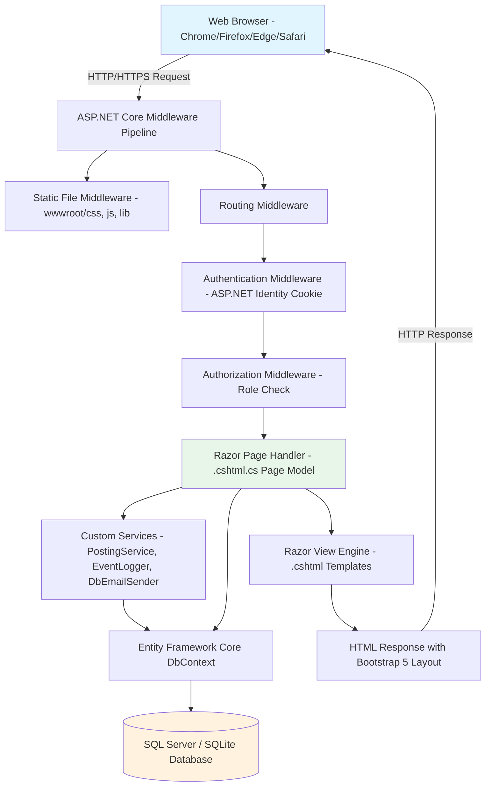
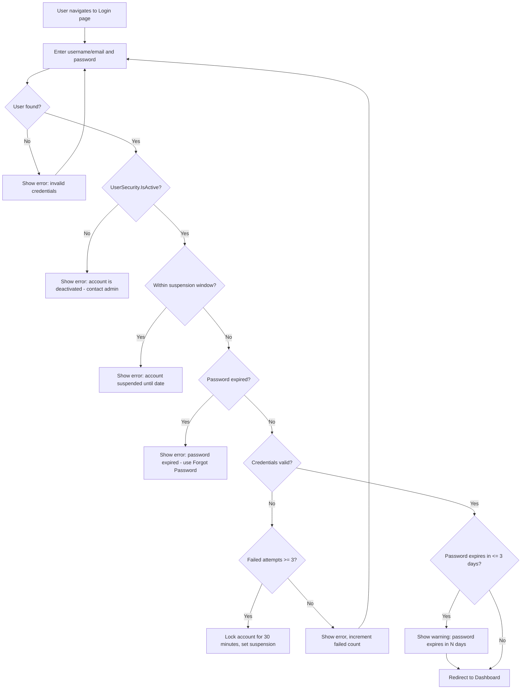
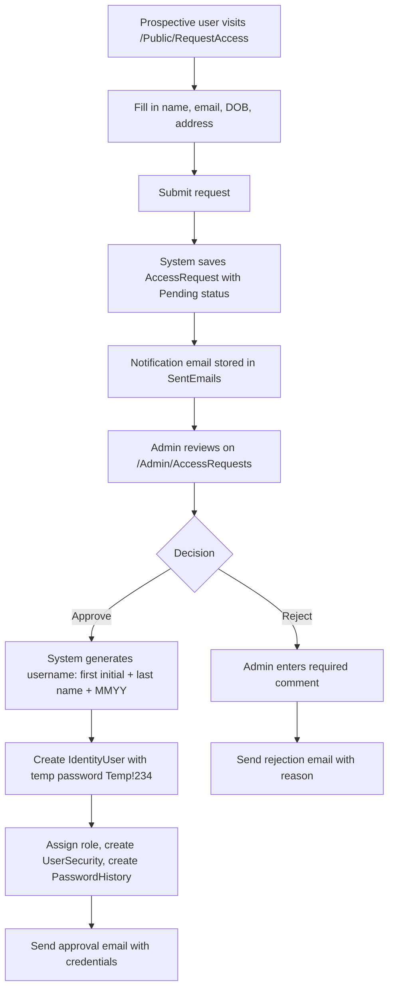
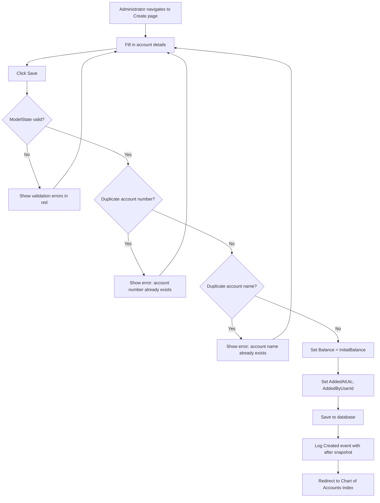
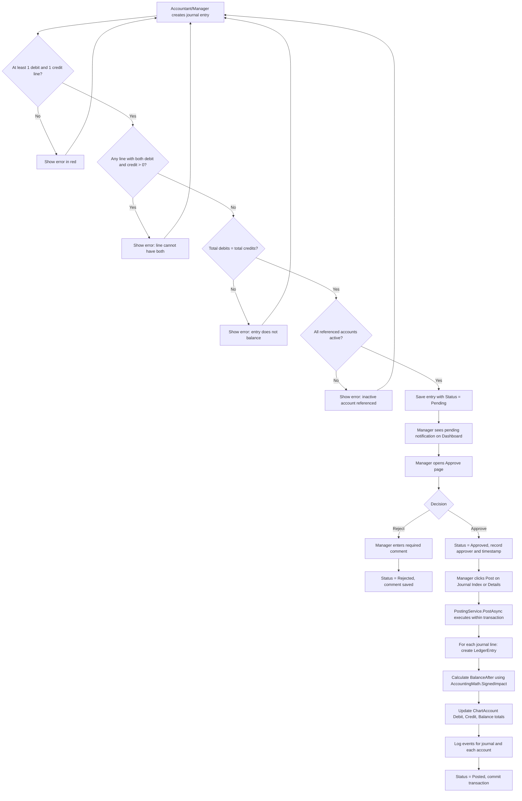

# Software Design and Testing Document (SDT)

## Group 7 Accounting System

**Course:** SWE4713 - Software Engineering | **Team:** Group 7 | **Version:** 1.0 | **Date:** [FILL IN]

---

# Part 1: Software Design

---

## 1. System Architecture

### 1.1 Architecture Pattern

The Group 7 Accounting System follows the ASP.NET Core 8 Razor Pages architecture pattern, which is a page-based variant of the Model-View-Controller (MVC) pattern. Key characteristics:

- **Page Model Pattern:** Each screen in the application consists of two files: a `.cshtml` file (the Razor view containing HTML markup with embedded C# expressions) and a `.cshtml.cs` file (the Page Model class that acts as both the controller and the view model). The Page Model handles HTTP GET and POST requests through `OnGet()` and `OnPost()` handler methods.
- **Dependency Injection:** The EF Core `ApplicationDbContext`, ASP.NET Identity services (`UserManager`, `RoleManager`, `SignInManager`), and custom services (`IPostingService`, `IEventLogger`, `IEmailSender`) are injected into Page Models via constructor injection, configured in `Program.cs`.
- **Middleware Pipeline:** ASP.NET Core's middleware pipeline processes every request sequentially through: static file serving, routing, authentication (ASP.NET Identity cookie validation), authorization (role-based policy enforcement), and finally the Razor Page endpoint.
- **Service Layer:** Reusable business logic is extracted into services: `PostingService` (ledger posting with transactions), `EventLogger` (audit trail recording), `DbEmailSender` (email outbox storage), and `AccountingMath` (debit/credit impact calculations).

### 1.2 Architecture Diagram



### 1.3 Request Flow

The following describes what happens when a user submits a form (e.g., creates a journal entry):

1. User fills out the journal entry form in the browser (entry date, description, debit/credit lines) and clicks Save.
2. Browser sends an HTTP POST request to the ASP.NET Core server at the `/Journal/Create` endpoint.
3. The Anti-Forgery Token middleware validates the `__RequestVerificationToken` included in the form to prevent CSRF attacks.
4. The Authentication middleware reads the encrypted Identity cookie and confirms the user is logged in. If not, the user is redirected to the Login page.
5. The Authorization middleware checks the `[Authorize(Roles = "Manager,Accountant")]` attribute on the CreateModel page and confirms the user has the required role.
6. ASP.NET Core's model binding system populates the Page Model's bound properties (EntryDate, Description, LineInputs) from the form data.
7. The Page Model's `OnPostSaveAsync()` handler executes.
8. Server-side validation runs: checks that at least one debit and one credit line exist, no line has both debit and credit, all referenced accounts are active, and total debits equal total credits.
9. If validation fails, the Page Model adds errors to ModelState and returns the page with error messages displayed in red.
10. If valid, the Page Model creates a new JournalEntry entity with status Pending and nested JournalLine entities, then calls `_db.SaveChangesAsync()`.
11. Entity Framework Core translates the entity graph into SQL INSERT statements and executes them against the database.
12. The Page Model issues a redirect response to the Journal Details page for the newly created entry.
13. The browser follows the redirect, and the Details page loads via a GET request showing the saved entry.

---

## 2. Database Design

### 2.1 Entity Relationship Diagram

```mermaid
erDiagram
    AspNetUsers {
        string Id PK
        string UserName
        string NormalizedUserName
        string Email
        string NormalizedEmail
        bool EmailConfirmed
        string PasswordHash
        string SecurityStamp
        string ConcurrencyStamp
        string PhoneNumber
        bool PhoneNumberConfirmed
        bool TwoFactorEnabled
        datetimeoffset LockoutEnd
        bool LockoutEnabled
        int AccessFailedCount
    }

    AspNetRoles {
        string Id PK
        string Name
        string NormalizedName
        string ConcurrencyStamp
    }

    AspNetUserRoles {
        string UserId PK_FK
        string RoleId PK_FK
    }

    UserSecurities {
        string UserId PK_FK
        datetime2 PasswordLastChangedAt
        datetime2 PasswordExpiresAt
        datetime2 SuspendedFrom
        datetime2 SuspendedUntil
        bit IsActive
        nvarchar SecurityQuestion
        nvarchar SecurityAnswerHash
    }

    PasswordHistories {
        int PasswordHistoryId PK
        string UserId FK
        string PasswordHash
        datetime2 CreatedAt
    }

    AccessRequests {
        int AccessRequestId PK
        nvarchar FirstName
        nvarchar LastName
        nvarchar Address
        datetime2 DateOfBirth
        nvarchar Email
        datetime2 RequestedAt
        int Status
        nvarchar AdminComment
        nvarchar ProcessedByUserId
        datetime2 ProcessedAt
        nvarchar ApprovedUsername
        nvarchar SetPasswordLink
    }

    ChartAccounts {
        int ChartAccountId PK
        nvarchar AccountName
        int AccountNumber
        nvarchar Description
        int NormalSide
        int Category
        nvarchar Subcategory
        decimal InitialBalance
        decimal Debit
        decimal Credit
        decimal Balance
        datetime2 AddedAtUtc
        nvarchar AddedByUserId
        nvarchar OrderCode
        nvarchar Statement
        nvarchar Comment
        bit IsActive
    }

    JournalEntries {
        int JournalEntryId PK
        datetime2 EntryDate
        nvarchar Description
        int Status
        nvarchar ManagerComment
        nvarchar CreatedByUserId
        datetime2 CreatedAtUtc
        nvarchar ApprovedByUserId
        datetime2 ApprovedAtUtc
        nvarchar PostedByUserId
        datetime2 PostedAtUtc
    }

    JournalLines {
        int JournalLineId PK
        int JournalEntryId FK
        int ChartAccountId FK
        decimal Debit
        decimal Credit
        nvarchar Memo
    }

    JournalAttachments {
        int JournalAttachmentId PK
        int JournalEntryId FK
        nvarchar OriginalFileName
        nvarchar StoredFileName
        nvarchar ContentType
        bigint SizeBytes
        datetime2 UploadedAtUtc
        nvarchar UploadedByUserId
    }

    LedgerEntries {
        int LedgerEntryId PK
        int ChartAccountId FK
        datetime2 EntryDate
        int JournalEntryId FK
        nvarchar Description
        decimal Debit
        decimal Credit
        decimal BalanceAfter
        datetime2 PostedAtUtc
    }

    EventLogs {
        int EventLogId PK
        nvarchar TableName
        int RecordId
        int Action
        nvarchar BeforeJson
        nvarchar AfterJson
        nvarchar UserId
        datetime2 CreatedAtUtc
    }

    AppErrorMessages {
        int AppErrorMessageId PK
        nvarchar Code
        nvarchar Message
    }

    SentEmails {
        int SentEmailId PK
        nvarchar ToEmail
        nvarchar ToUserId
        nvarchar Subject
        nvarchar BodyHtml
        datetime2 SentAtUtc
        nvarchar SentByUserId
        nvarchar Channel
    }

    AspNetUsers ||--o{ AspNetUserRoles : "has roles"
    AspNetRoles ||--o{ AspNetUserRoles : "assigned to users"
    AspNetUsers ||--|| UserSecurities : "has security settings"
    AspNetUsers ||--o{ PasswordHistories : "has password history"
    JournalEntries ||--|{ JournalLines : "contains lines"
    JournalEntries ||--o{ JournalAttachments : "has attachments"
    JournalEntries ||--o{ LedgerEntries : "posted as ledger entries"
    ChartAccounts ||--o{ JournalLines : "referenced by lines"
    ChartAccounts ||--o{ LedgerEntries : "has ledger entries"
```

### 2.2 Table Descriptions

#### Table: ChartAccounts
**Purpose:** Stores all accounts in the organization's chart of accounts, tracking names, numbers, categories, balances, and active status.

| Column | Data Type | Constraints | Description |
|--------|-----------|-------------|-------------|
| ChartAccountId | int | PK, auto-increment | Primary key |
| AccountName | nvarchar(120) | Required, unique | Human-readable account name |
| AccountNumber | int | Required, unique | Numeric identifier (first digit indicates category) |
| Description | nvarchar(500) | Optional | Explanation of what the account tracks |
| NormalSide | int | Required | 0 = Debit, 1 = Credit |
| Category | int | Required | 0=Asset, 1=Liability, 2=Equity, 3=Revenue, 4=Expense |
| Subcategory | nvarchar(100) | Optional | Further classification (e.g., Current Assets) |
| InitialBalance | decimal(18,2) | Required, >= 0 | Starting balance when account was created |
| Debit | decimal(18,2) | Required | Cumulative debit total from posted entries |
| Credit | decimal(18,2) | Required | Cumulative credit total from posted entries |
| Balance | decimal(18,2) | Required | Current account balance |
| AddedAtUtc | datetime2 | Required | When the account was created |
| AddedByUserId | nvarchar(450) | Optional | Identity user ID of creator |
| OrderCode | nvarchar(10) | Required | Sort order within category |
| Statement | nvarchar(5) | Required | IS (Income Statement), BS (Balance Sheet), RE (Retained Earnings) |
| Comment | nvarchar(500) | Optional | Notes about the account |
| IsActive | bit | Required | Whether account is active (true) or deactivated (false) |

#### Table: JournalEntries
**Purpose:** Stores journal entry headers with date, description, status, and workflow tracking (who created, approved, and posted the entry).

| Column | Data Type | Constraints | Description |
|--------|-----------|-------------|-------------|
| JournalEntryId | int | PK, auto-increment | Primary key |
| EntryDate | datetime2 | Required | Date of the accounting transaction |
| Description | nvarchar(200) | Optional | Description of the journal entry |
| Status | int | Required | 0=Pending, 1=Approved, 2=Rejected, 3=Posted |
| ManagerComment | nvarchar(500) | Optional | Rejection reason or manager notes |
| CreatedByUserId | nvarchar(450) | Optional | Identity user ID of creator |
| CreatedAtUtc | datetime2 | Required | Creation timestamp |
| ApprovedByUserId | nvarchar(450) | Optional | Identity user ID of approver/rejector |
| ApprovedAtUtc | datetime2 | Optional | Approval/rejection timestamp |
| PostedByUserId | nvarchar(450) | Optional | Identity user ID of poster |
| PostedAtUtc | datetime2 | Optional | Posting timestamp |

#### Table: JournalLines
**Purpose:** Stores individual debit/credit lines within a journal entry, each referencing a chart of accounts entry.

| Column | Data Type | Constraints | Description |
|--------|-----------|-------------|-------------|
| JournalLineId | int | PK, auto-increment | Primary key |
| JournalEntryId | int | FK, Required | Reference to parent JournalEntry |
| ChartAccountId | int | FK, Required | Reference to the chart of accounts entry |
| Debit | decimal(18,2) | Required, >= 0 | Debit amount (0 if this is a credit line) |
| Credit | decimal(18,2) | Required, >= 0 | Credit amount (0 if this is a debit line) |
| Memo | nvarchar(200) | Optional | Line-level description or note |

#### Table: JournalAttachments
**Purpose:** Stores metadata for source document files attached to journal entries.

| Column | Data Type | Constraints | Description |
|--------|-----------|-------------|-------------|
| JournalAttachmentId | int | PK, auto-increment | Primary key |
| JournalEntryId | int | FK, Required | Reference to parent JournalEntry |
| OriginalFileName | nvarchar(255) | Required | Original filename as uploaded by user |
| StoredFileName | nvarchar(255) | Required | Randomly generated filename on disk |
| ContentType | nvarchar(100) | Required | MIME type of the file |
| SizeBytes | bigint | Required | File size in bytes |
| UploadedAtUtc | datetime2 | Required | Upload timestamp |
| UploadedByUserId | nvarchar(450) | Optional | Identity user ID of uploader |

#### Table: LedgerEntries
**Purpose:** Stores ledger postings created when a journal entry is posted, with running balance for each account.

| Column | Data Type | Constraints | Description |
|--------|-----------|-------------|-------------|
| LedgerEntryId | int | PK, auto-increment | Primary key |
| ChartAccountId | int | FK, Required | Reference to the chart of accounts entry |
| EntryDate | datetime2 | Required | Date of the original journal entry |
| JournalEntryId | int | FK, Required | Post reference - links back to source journal |
| Description | nvarchar(200) | Optional | Copied from journal entry description |
| Debit | decimal(18,2) | Required | Debit amount for this posting |
| Credit | decimal(18,2) | Required | Credit amount for this posting |
| BalanceAfter | decimal(18,2) | Required | Running balance after this entry |
| PostedAtUtc | datetime2 | Required | When this ledger entry was created |

#### Table: EventLogs
**Purpose:** Audit trail storing every data modification with before/after JSON snapshots for accountability and compliance.

| Column | Data Type | Constraints | Description |
|--------|-----------|-------------|-------------|
| EventLogId | int | PK, auto-increment | Primary key |
| TableName | nvarchar(100) | Required | Name of the table that was modified |
| RecordId | int | Required | Primary key of the modified record |
| Action | int | Required | 1=Created, 2=Updated, 3=Activated, 4=Deactivated, 5=Deleted, 10=Approved, 11=Rejected, 20=Posted, 30=Uploaded |
| BeforeJson | nvarchar(max) | Optional | JSON snapshot of record before the change |
| AfterJson | nvarchar(max) | Optional | JSON snapshot of record after the change |
| UserId | nvarchar(450) | Optional | Identity user ID of who made the change |
| CreatedAtUtc | datetime2 | Required | When the event was recorded |

#### Table: UserSecurities
**Purpose:** Extends ASP.NET Identity user with password expiration, suspension, active status, and security question data.

| Column | Data Type | Constraints | Description |
|--------|-----------|-------------|-------------|
| UserId | nvarchar(450) | PK, FK | References AspNetUsers.Id |
| PasswordLastChangedAt | datetime2 | Required | When password was last changed |
| PasswordExpiresAt | datetime2 | Required | When the current password expires (90 days from last change) |
| SuspendedFrom | datetime2 | Optional | Start of suspension window |
| SuspendedUntil | datetime2 | Optional | End of suspension window |
| IsActive | bit | Required | Whether the account is active |
| SecurityQuestion | nvarchar(200) | Optional | User's chosen security question |
| SecurityAnswerHash | nvarchar(128) | Optional | SHA-256 hash of the security answer |

#### Table: PasswordHistories
**Purpose:** Tracks previously used password hashes to prevent password reuse.

| Column | Data Type | Constraints | Description |
|--------|-----------|-------------|-------------|
| PasswordHistoryId | int | PK, auto-increment | Primary key |
| UserId | nvarchar(450) | FK, Required | References AspNetUsers.Id |
| PasswordHash | nvarchar(max) | Required | Hash of the previously used password |
| CreatedAt | datetime2 | Required | When this password was set |

#### Table: AccessRequests
**Purpose:** Stores access requests from prospective users, tracked through Pending/Approved/Rejected workflow.

| Column | Data Type | Constraints | Description |
|--------|-----------|-------------|-------------|
| AccessRequestId | int | PK, auto-increment | Primary key |
| FirstName | nvarchar(50) | Required | Applicant's first name |
| LastName | nvarchar(50) | Required | Applicant's last name |
| Address | nvarchar(200) | Required | Applicant's address |
| DateOfBirth | datetime2 | Required | Applicant's date of birth |
| Email | nvarchar(256) | Required, email format | Applicant's email address |
| RequestedAt | datetime2 | Required | When the request was submitted |
| Status | int | Required | 0=Pending, 1=Approved, 2=Rejected |
| AdminComment | nvarchar(500) | Optional | Administrator's comment (required on rejection) |
| ProcessedByUserId | nvarchar(450) | Optional | Admin who processed the request |
| ProcessedAt | datetime2 | Optional | When the request was processed |
| ApprovedUsername | nvarchar(256) | Optional | Generated username for approved users |
| SetPasswordLink | nvarchar(2000) | Optional | Password reset link sent to approved user |

#### Table: SentEmails
**Purpose:** Email outbox storing all system-generated emails for administrator review and audit purposes.

| Column | Data Type | Constraints | Description |
|--------|-----------|-------------|-------------|
| SentEmailId | int | PK, auto-increment | Primary key |
| ToEmail | nvarchar(256) | Required | Recipient email address |
| ToUserId | nvarchar(256) | Optional | Identity user ID of recipient (if known) |
| Subject | nvarchar(200) | Required | Email subject line |
| BodyHtml | nvarchar(max) | Required | Full HTML body of the email |
| SentAtUtc | datetime2 | Required | When the email was sent/stored |
| SentByUserId | nvarchar(450) | Optional | Identity user ID of sender |
| Channel | nvarchar(50) | Required | Delivery channel (default: "OutboxDb") |

#### Table: AppErrorMessages
**Purpose:** Centralized storage for application error message templates.

| Column | Data Type | Constraints | Description |
|--------|-----------|-------------|-------------|
| AppErrorMessageId | int | PK, auto-increment | Primary key |
| Code | nvarchar(100) | Required | Error code identifier |
| Message | nvarchar(500) | Required | Human-readable error message text |

### 2.3 Key Relationships

- **JournalEntry to JournalLine (One-to-Many):** Each journal entry contains one or more journal lines. When a journal entry is created, all its lines are saved as child records. This enforces the accounting concept that a journal entry is a complete transaction with multiple account impacts.

- **JournalEntry to JournalAttachment (One-to-Many):** Each journal entry can have zero or more file attachments. Attachments are uploaded separately after the entry is created and stored with metadata linking back to the parent entry.

- **JournalEntry to LedgerEntry (One-to-Many):** When a journal entry is posted, one ledger entry is created for each journal line. The JournalEntryId on the ledger entry serves as the Post Reference (PR), providing traceability from the ledger back to the original transaction.

- **ChartAccount to JournalLine (One-to-Many):** Each journal line references exactly one chart of accounts entry. Multiple journal lines across different entries can reference the same account.

- **ChartAccount to LedgerEntry (One-to-Many):** Each ledger entry belongs to one chart of accounts entry. The collection of ledger entries for an account forms that account's general ledger.

- **AspNetUsers to UserSecurities (One-to-One):** Each Identity user has exactly one UserSecurity record tracking password expiration, suspension, active status, and security question data. The UserSecurity.UserId is both the primary key and a foreign key to AspNetUsers.Id.

- **AspNetUsers to PasswordHistories (One-to-Many):** Each user has zero or more password history records. The most recent 5 are checked to prevent password reuse.

- **AspNetUsers to AspNetRoles (Many-to-Many via AspNetUserRoles):** Users are assigned to roles through the Identity join table. Each user has exactly one role in this system (Administrator, Manager, or Accountant).

---

## 3. Module Design

### 3.1 User Management Module

**Pages involved:**
- Areas/Identity/Pages/Account/Login.cshtml(.cs)
- Areas/Identity/Pages/Account/Logout.cshtml(.cs)
- Areas/Identity/Pages/Account/Register.cshtml(.cs)
- Areas/Identity/Pages/Account/ForgotPassword.cshtml(.cs)
- Areas/Identity/Pages/Account/ResetPassword.cshtml(.cs)
- Areas/Identity/Pages/Account/Manage/ChangePassword.cshtml(.cs)
- Pages/Account/ForgotPasswordCustom.cshtml(.cs)
- Pages/Public/RequestAccess.cshtml(.cs)
- Pages/Admin/AccessRequests.cshtml(.cs)
- Pages/Admin/Users/Index.cshtml(.cs)
- Pages/Admin/Users/Edit.cshtml(.cs)
- Pages/Admin/EditUser.cshtml(.cs)
- Pages/Admin/ExpiredPasswords.cshtml(.cs)
- Pages/Admin/SuspendUser.cshtml(.cs)
- Pages/Admin/EmailOutbox.cshtml(.cs)
- Pages/Admin/EmailOutboxDetails.cshtml(.cs)

**Models involved:** IdentityUser, UserSecurity, PasswordHistory, AccessRequest, SentEmail

**Security services:** StartsWithLetterPasswordValidator, PasswordHistoryValidator, SecurityAnswerHasher

**Key workflows:**

**Login Flow:**



**Access Request and User Creation Flow:**



### 3.2 Chart of Accounts Module

**Pages involved:**
- Pages/ChartOfAccounts/Index.cshtml(.cs)
- Pages/ChartOfAccounts/Create.cshtml(.cs)
- Pages/ChartOfAccounts/Edit.cshtml(.cs)
- Pages/ChartOfAccounts/Logs.cshtml(.cs)

**Models involved:** ChartAccount, EventLog, NormalSide enum, AccountCategory enum

**Key business rules enforced in page model logic:**
- No duplicate account numbers (checked against existing records, excluding self on edit)
- No duplicate account names (checked against existing records, excluding self on edit)
- Account number must be an integer (enforced by int data type)
- Balance > 0 prevents deactivation
- Event log written on every create, update, deactivate, and activate

**Add New Account Flow:**



### 3.3 Journal Entry and Ledger Module

**Pages involved:**
- Pages/Journal/Create.cshtml(.cs)
- Pages/Journal/Index.cshtml(.cs)
- Pages/Journal/Details.cshtml(.cs)
- Pages/Journal/Approve.cshtml(.cs)
- Pages/Ledger/Index.cshtml(.cs)
- Pages/Ledger/ByJournal.cshtml(.cs)

**Models involved:** JournalEntry, JournalLine, JournalAttachment, LedgerEntry, ChartAccount, JournalStatus enum

**Services involved:** PostingService, AccountingMath, EventLogger

**Journal Entry Approval and Posting Workflow:**



**AccountingMath.SignedImpact Logic:**
- For Debit-normal accounts (Assets, Expenses): impact = debit - credit (debits increase, credits decrease)
- For Credit-normal accounts (Liabilities, Equity, Revenue): impact = credit - debit (credits increase, debits decrease)
- New balance = previous balance + impact

### 3.4 Financial Reports Module

**Pages involved:** [NOT YET IMPLEMENTED - no report pages exist in the codebase]

**Models involved:** ChartAccount, LedgerEntry (data sources for report calculations)

**Report calculation logic (design specification for implementation):**

- **Trial Balance:** Query all ChartAccounts where Balance != 0. Display each account with its debit balance (if debit-normal with positive balance, or credit-normal with negative balance) or credit balance (vice versa). Total debits must equal total credits.

- **Income Statement:** For a given date range, sum all ledger entries for Revenue accounts (AccountCategory.Revenue) and Expense accounts (AccountCategory.Expense). Net Income = Total Revenue - Total Expenses.

- **Balance Sheet:** At a given date, show: Total Assets (AccountCategory.Asset), Total Liabilities (AccountCategory.Liability), Total Equity (AccountCategory.Equity). Must satisfy: Assets = Liabilities + Equity.

- **Retained Earnings:** Beginning Retained Earnings + Net Income (from Income Statement) - Dividends (if tracked) = Ending Retained Earnings.

### 3.5 Dashboard and Ratio Module

**Pages involved:**
- Pages/Index.cshtml(.cs)
- Pages/Dashboard.cshtml(.cs)

**Models involved:** JournalEntry (for notification counts)

**Current implementation:**
- Counts pending journal entries (status = Pending)
- Counts rejected journal entries (status = Rejected)
- Counts approved-but-not-posted entries (status = Approved)
- Displays role-appropriate notifications (pending approvals for Managers)
- Provides navigation cards to all modules

**Financial ratios:** [NOT YET IMPLEMENTED - the dashboard currently shows notification counts and navigation only. Financial ratio calculations and color-coded indicators have not been built yet.]

When implemented, the following ratios should be calculated from account balances:

| Ratio | Formula | Green | Yellow | Red |
|-------|---------|-------|--------|-----|
| Current Ratio | Current Assets / Current Liabilities | > 1.5 | 1.0 - 1.5 | < 1.0 |
| Quick Ratio | (Current Assets - Inventory) / Current Liabilities | > 1.0 | 0.5 - 1.0 | < 0.5 |
| Debt-to-Equity | Total Liabilities / Total Equity | < 1.0 | 1.0 - 2.0 | > 2.0 |
| Return on Assets | Net Income / Total Assets | > 10% | 5% - 10% | < 5% |
| Return on Equity | Net Income / Total Equity | > 15% | 8% - 15% | < 8% |
| Profit Margin | Net Income / Total Revenue | > 15% | 5% - 15% | < 5% |
| Asset Turnover | Total Revenue / Total Assets | > 1.0 | 0.5 - 1.0 | < 0.5 |
| Equity Ratio | Total Equity / Total Assets | > 0.5 | 0.3 - 0.5 | < 0.3 |

[FILL IN: Update these ratio thresholds and add/remove ratios based on the course-specified requirements when the feature is implemented.]

---

## 4. Security Design

### 4.1 Authentication

- ASP.NET Identity manages all user authentication using the `SignInManager<IdentityUser>` service.
- Passwords are hashed using PBKDF2 with HMAC-SHA256 (ASP.NET Identity's default hasher).
- Sessions are managed via encrypted authentication cookies issued by the Identity middleware.
- Security question answers are hashed using SHA-256 with lowercase normalization and stored in the UserSecurities table.
- Custom password validators (StartsWithLetterPasswordValidator, PasswordHistoryValidator) are registered as scoped services and run on every password change.

### 4.2 Authorization

The following table shows every page in the application and which roles can access it, based on `[Authorize]` attributes found in the code:

| Page | Route | Public | Admin | Manager | Accountant |
|------|-------|--------|-------|---------|------------|
| Login | /Identity/Account/Login | Yes | - | - | - |
| Logout | /Identity/Account/Logout | - | Yes | Yes | Yes |
| Register (redirect) | /Identity/Account/Register | Yes | - | - | - |
| Forgot Password | /Identity/Account/ForgotPassword | Yes | - | - | - |
| Forgot Password Custom | /Account/ForgotPasswordCustom | Yes | - | - | - |
| Reset Password | /Identity/Account/ResetPassword | Yes | - | - | - |
| Change Password | /Identity/Account/Manage/ChangePassword | - | Yes | Yes | Yes |
| Request Access | /Public/RequestAccess | Yes | - | - | - |
| Help | /Help | Yes | Yes | Yes | Yes |
| Privacy | /Privacy | Yes | Yes | Yes | Yes |
| Home / Index | / | - | Yes | Yes | Yes |
| Dashboard | /Dashboard | - | Yes | Yes | Yes |
| Chart of Accounts Index | /ChartOfAccounts | - | Yes | Yes | Yes |
| Chart of Accounts Create | /ChartOfAccounts/Create | - | Yes | No | No |
| Chart of Accounts Edit | /ChartOfAccounts/Edit | - | Yes | No | No |
| Chart of Accounts Logs | /ChartOfAccounts/Logs | - | Yes | Yes | Yes |
| Journal Index | /Journal | - | Yes | Yes | Yes |
| Journal Create | /Journal/Create | - | No | Yes | Yes |
| Journal Details | /Journal/Details | - | Yes | Yes | Yes |
| Journal Approve | /Journal/Approve | - | No | Yes | No |
| Ledger Index | /Ledger | - | Yes | Yes | Yes |
| Ledger By Journal | /Ledger/ByJournal | - | Yes | Yes | Yes |
| Admin - Access Requests | /Admin/AccessRequests | - | Yes | No | No |
| Admin - Users Index | /Admin/Users | - | Yes | No | No |
| Admin - Users Edit | /Admin/Users/Edit | - | Yes | No | No |
| Admin - Edit User | /Admin/EditUser | - | Yes | No | No |
| Admin - Expired Passwords | /Admin/ExpiredPasswords | - | Yes | No | No |
| Admin - Suspend User | /Admin/SuspendUser | - | Yes | No | No |
| Admin - Event Logs Index | /Admin/EventLogs | - | Yes | No | No |
| Admin - Event Logs View | /Admin/EventLogs/View | - | Yes | Yes | No |
| Admin - Email Outbox | /Admin/EmailOutbox | - | Yes | No | No |
| Admin - Email Outbox Details | /Admin/EmailOutboxDetails | - | Yes | No | No |
| Error | /Error | Yes | Yes | Yes | Yes |

### 4.3 Anti-Forgery Protection

All POST forms in the application include ASP.NET Core's anti-forgery token. Razor Pages automatically generates and validates `__RequestVerificationToken` on every POST request via the `[ValidateAntiForgeryToken]` filter that is applied by default. This prevents Cross-Site Request Forgery (CSRF) attacks where a malicious site attempts to submit forms on behalf of an authenticated user.

---

# Part 2: Testing

---

## 5. Testing Strategy

### 5.1 Approach

The project uses manual functional testing conducted per sprint. Each sprint's features are tested against the sprint requirements list before the team moves to the next sprint. Testing is performed by team members using the running application in a browser, verifying both positive (expected behavior) and negative (error handling) scenarios.

### 5.2 Testing Levels

- **Unit Level:** Individual page model methods and services are verified to produce correct output. For example, `AccountingMath.SignedImpact()` is tested with various debit/credit combinations for both normal sides.
- **Integration Level:** Pages are tested to confirm they interact correctly with the database via EF Core. For example, creating a chart of accounts entry and verifying it appears in the database and on the index page.
- **System Level:** Complete user workflows are tested end-to-end. For example, the full journal entry lifecycle: create entry -> submit -> manager approves -> post to ledger -> verify ledger entries.
- **Acceptance Level:** Each sprint's deliverables are verified against the sprint requirements list to confirm all specified features are present and functional.

---

## 6. Test Cases

### 6.1 User Management Tests

| Test ID | Feature | Test Description | Preconditions | Steps | Expected Result | Actual Result | Pass/Fail |
|---------|---------|------------------|---------------|-------|-----------------|---------------|-----------|
| TC-001 | Login | Valid login with correct username and password | User account exists and is active | 1. Navigate to Login page 2. Enter valid username 3. Enter correct password 4. Click Login | User is redirected to Home/Dashboard page | [FILL IN] | [FILL IN] |
| TC-002 | Login | Valid login using email instead of username | User account exists with confirmed email | 1. Navigate to Login page 2. Enter user's email address 3. Enter correct password 4. Click Login | User is redirected to Home/Dashboard page | [FILL IN] | [FILL IN] |
| TC-003 | Login | Invalid login with wrong password | User account exists | 1. Navigate to Login page 2. Enter valid username 3. Enter wrong password 4. Click Login | Error message displayed; AccessFailedCount incremented | [FILL IN] | [FILL IN] |
| TC-004 | Login | Account lockout after 3 failed attempts | User account exists, 0 failed attempts | 1. Enter wrong password 3 times consecutively | Account is locked; lockout message displayed; cannot login for 30 minutes | [FILL IN] | [FILL IN] |
| TC-005 | Login | Login with deactivated account | User has IsActive = false | 1. Enter correct credentials for deactivated user | Error message: account deactivated, contact administrator | [FILL IN] | [FILL IN] |
| TC-006 | Login | Login with suspended account | User has active suspension window | 1. Enter correct credentials during suspension | Error message: account suspended until [date] | [FILL IN] | [FILL IN] |
| TC-007 | Login | Login with expired password | User's PasswordExpiresAt is in the past | 1. Enter correct credentials | Error message: password expired, use Forgot Password | [FILL IN] | [FILL IN] |
| TC-008 | Login | Password expiry warning (3 days) | Password expires in 2 days | 1. Login with correct credentials | Successful login with warning: password expires in 2 days | [FILL IN] | [FILL IN] |
| TC-009 | Password | Password complexity - too short | User on change/reset password page | 1. Enter password shorter than 8 characters | Validation error: minimum 8 characters | [FILL IN] | [FILL IN] |
| TC-010 | Password | Password complexity - missing digit | User on change/reset password page | 1. Enter password without any digit | Validation error: must contain a digit | [FILL IN] | [FILL IN] |
| TC-011 | Password | Password complexity - missing special char | User on change/reset password page | 1. Enter password without special character | Validation error: must contain special character | [FILL IN] | [FILL IN] |
| TC-012 | Password | Password does not start with letter | User on change/reset password page | 1. Enter password starting with a number | Validation error: must start with a letter | [FILL IN] | [FILL IN] |
| TC-013 | Password | Password reuse prevention | User has password history | 1. Try to set password to one of the last 5 used passwords | Validation error: cannot reuse recent password | [FILL IN] | [FILL IN] |
| TC-014 | Forgot Password | Complete forgot password flow | User has security question configured | 1. Click Forgot Password 2. Enter username and email 3. Answer security question correctly 4. Use reset link 5. Set new password | Password is reset; user can login with new password | [FILL IN] | [FILL IN] |
| TC-015 | Forgot Password | Wrong security answer | User has security question configured | 1. Click Forgot Password 2. Enter username and email 3. Enter wrong security answer | Error message: incorrect answer | [FILL IN] | [FILL IN] |
| TC-016 | Admin - Create User | Approve access request | Pending access request exists | 1. Navigate to Access Requests 2. Select role 3. Click Approve | User created with auto-generated username; approval email stored | [FILL IN] | [FILL IN] |
| TC-017 | Admin - Create User | Username format validation | Access request for "John Smith" in March 2026 | 1. Approve the request | Generated username: jsmith0326 | [FILL IN] | [FILL IN] |
| TC-018 | Admin - Reject User | Reject access request without comment | Pending access request exists | 1. Click Reject without entering a comment | Error: comment is required | [FILL IN] | [FILL IN] |
| TC-019 | Admin - Deactivate User | Deactivate an active user | Active user exists | 1. Navigate to Suspend User 2. Select user 3. Check Deactivate 4. Submit | User IsActive set to false; user cannot login | [FILL IN] | [FILL IN] |
| TC-020 | Admin - Unlock | Unlock a locked account | User account is locked out | 1. Navigate to Edit User 2. Click Unlock | LockoutEnd cleared; AccessFailedCount reset to 0 | [FILL IN] | [FILL IN] |

### 6.2 Chart of Accounts Tests

| Test ID | Feature | Test Description | Preconditions | Steps | Expected Result | Actual Result | Pass/Fail |
|---------|---------|------------------|---------------|-------|-----------------|---------------|-----------|
| TC-021 | COA Create | Add valid account with all fields | Logged in as Administrator | 1. Navigate to Create 2. Fill all fields correctly 3. Click Save | Account created, appears in index, event log recorded | [FILL IN] | [FILL IN] |
| TC-022 | COA Create | Reject duplicate account number | Account 1000 exists | 1. Try to create another account with number 1000 | Error: account number already exists | [FILL IN] | [FILL IN] |
| TC-023 | COA Create | Reject duplicate account name | Account "Cash" exists | 1. Try to create another account named "Cash" | Error: account name already exists | [FILL IN] | [FILL IN] |
| TC-024 | COA Edit | Edit account details | Account exists | 1. Navigate to Edit 2. Change description 3. Save | Description updated; event log shows before/after | [FILL IN] | [FILL IN] |
| TC-025 | COA Deactivate | Deactivate account with zero balance | Account has Balance = 0 | 1. Click Deactivate | Account IsActive set to false; event log recorded | [FILL IN] | [FILL IN] |
| TC-026 | COA Deactivate | Prevent deactivating account with balance | Account has Balance > 0 | 1. Click Deactivate | Error: cannot deactivate account with non-zero balance | [FILL IN] | [FILL IN] |
| TC-027 | COA Activate | Reactivate a deactivated account | Account is inactive | 1. Click Activate | Account IsActive set to true; event log recorded | [FILL IN] | [FILL IN] |
| TC-028 | COA Search | Search by account number | Multiple accounts exist | 1. Enter account number in search 2. Submit | Only matching account displayed | [FILL IN] | [FILL IN] |
| TC-029 | COA Search | Search by account name | Multiple accounts exist | 1. Enter partial name in search 2. Submit | Accounts with matching names displayed | [FILL IN] | [FILL IN] |
| TC-030 | COA Filter | Filter by category | Accounts in multiple categories | 1. Select "Asset" from category dropdown | Only Asset accounts displayed | [FILL IN] | [FILL IN] |
| TC-031 | COA Access | Manager cannot edit accounts | Logged in as Manager | 1. Navigate to Chart of Accounts | No Edit or Create buttons visible | [FILL IN] | [FILL IN] |
| TC-032 | COA Event Log | Verify event log on create | Administrator creates account | 1. Create new account 2. View event logs | Event log entry shows Created action with after snapshot | [FILL IN] | [FILL IN] |

### 6.3 Journal Entry Tests

| Test ID | Feature | Test Description | Preconditions | Steps | Expected Result | Actual Result | Pass/Fail |
|---------|---------|------------------|---------------|-------|-----------------|---------------|-----------|
| TC-033 | Journal Create | Create balanced journal entry | Active accounts exist | 1. Select date 2. Add debit line (Cash $500) 3. Add credit line (Revenue $500) 4. Save | Entry saved with Pending status | [FILL IN] | [FILL IN] |
| TC-034 | Journal Create | Reject unbalanced entry | Active accounts exist | 1. Add debit $500 2. Add credit $300 3. Save | Error: debits must equal credits | [FILL IN] | [FILL IN] |
| TC-035 | Journal Create | Reject entry with no debit lines | Active accounts exist | 1. Add only credit lines 2. Save | Error: must have at least one debit line | [FILL IN] | [FILL IN] |
| TC-036 | Journal Create | Reject line with both debit and credit | Active accounts exist | 1. Enter both debit and credit on same line 2. Save | Error: line cannot have both debit and credit | [FILL IN] | [FILL IN] |
| TC-037 | Journal Create | Reject inactive account reference | Inactive account exists | 1. Create entry referencing inactive account 2. Save | Error: referenced account is inactive | [FILL IN] | [FILL IN] |
| TC-038 | Journal Approve | Manager approves pending entry | Pending balanced entry exists | 1. Login as Manager 2. Navigate to Approve page 3. Click Approve | Status changes to Approved; ApprovedByUserId set | [FILL IN] | [FILL IN] |
| TC-039 | Journal Reject | Manager rejects with comment | Pending entry exists | 1. Login as Manager 2. Click Reject 3. Enter reason 4. Submit | Status = Rejected; ManagerComment saved | [FILL IN] | [FILL IN] |
| TC-040 | Journal Reject | Manager rejects without comment | Pending entry exists | 1. Click Reject without entering comment | Error: rejection comment is required | [FILL IN] | [FILL IN] |
| TC-041 | Journal Post | Post approved entry to ledger | Approved balanced entry exists | 1. Login as Manager 2. Click Post | LedgerEntries created; account balances updated; Status = Posted | [FILL IN] | [FILL IN] |
| TC-042 | Journal Post | Verify ledger running balance | Approved entry: Cash debit $1000, Revenue credit $1000 | 1. Post entry 2. View Cash ledger | LedgerEntry shows BalanceAfter = previous + $1000 | [FILL IN] | [FILL IN] |
| TC-043 | Journal Post | Post reference links to journal | Posted entry exists | 1. View account ledger 2. Click PR number | Navigates to Journal Details page for that entry | [FILL IN] | [FILL IN] |
| TC-044 | Journal Attach | Upload valid file attachment | Journal entry exists | 1. Select PDF file 2. Click Upload | File stored; JournalAttachment record created | [FILL IN] | [FILL IN] |
| TC-045 | Journal Attach | Reject invalid file type | Journal entry exists | 1. Select .exe file 2. Click Upload | Error: file type not allowed | [FILL IN] | [FILL IN] |
| TC-046 | Journal Filter | Filter by status | Entries in multiple statuses | 1. Select "Pending" from status filter | Only pending entries displayed | [FILL IN] | [FILL IN] |
| TC-047 | Journal Search | Search by amount | Entries with various amounts | 1. Enter amount in search 2. Submit | Entries with matching debit or credit amounts displayed | [FILL IN] | [FILL IN] |
| TC-048 | Ledger | View ledger for specific account | Posted entries exist | 1. Click account name on COA 2. View ledger | All ledger entries for that account shown with running balance | [FILL IN] | [FILL IN] |

### 6.4 Financial Report Tests

| Test ID | Feature | Test Description | Preconditions | Steps | Expected Result | Actual Result | Pass/Fail |
|---------|---------|------------------|---------------|-------|-----------------|---------------|-----------|
| TC-049 | Trial Balance | Trial balance shows non-zero accounts only | Mix of zero and non-zero balance accounts | 1. Generate trial balance | Only accounts with Balance != 0 displayed | [FILL IN] | [FILL IN] |
| TC-050 | Trial Balance | Trial balance debits equal credits | Posted entries exist | 1. Generate trial balance | Total Debits column = Total Credits column | [FILL IN] | [FILL IN] |
| TC-051 | Income Statement | Income statement for date range | Revenue and expense entries posted | 1. Select date range 2. Generate income statement | Revenue minus expenses shown; net income calculated | [FILL IN] | [FILL IN] |
| TC-052 | Balance Sheet | Balance sheet balances | Various account types have balances | 1. Generate balance sheet | Assets = Liabilities + Equity | [FILL IN] | [FILL IN] |
| TC-053 | Retained Earnings | Retained earnings calculation | Net income and beginning RE known | 1. Generate retained earnings statement | Beginning RE + Net Income - Dividends = Ending RE | [FILL IN] | [FILL IN] |
| TC-054 | Reports | Date range filtering | Entries across multiple dates | 1. Set start and end date 2. Generate report | Only entries within date range included | [FILL IN] | [FILL IN] |
| TC-055 | Reports | Empty date range | No entries in selected range | 1. Select date range with no entries 2. Generate | Report shows zero totals or empty state | [FILL IN] | [FILL IN] |
| TC-056 | Reports | Full period report | All entries selected | 1. Set wide date range covering all entries | All posted entries included in calculations | [FILL IN] | [FILL IN] |

Note: TC-049 through TC-056 test Sprint 4 features that are [NOT YET IMPLEMENTED]. These test cases should be executed once the Financial Reports module is built.

### 6.5 Dashboard Tests

| Test ID | Feature | Test Description | Preconditions | Steps | Expected Result | Actual Result | Pass/Fail |
|---------|---------|------------------|---------------|-------|-----------------|---------------|-----------|
| TC-057 | Dashboard | Pending count shown for Manager | Pending journal entries exist | 1. Login as Manager 2. View Dashboard | Warning alert shows count of pending entries | [FILL IN] | [FILL IN] |
| TC-058 | Dashboard | Approved-not-posted count shown | Approved (not posted) entries exist | 1. Login as Manager 2. View Dashboard | Info alert shows count of approved-not-posted entries | [FILL IN] | [FILL IN] |
| TC-059 | Dashboard | Rejected count shown | Rejected entries exist | 1. Login 2. View Dashboard | Secondary alert shows rejected entry count | [FILL IN] | [FILL IN] |
| TC-060 | Dashboard | No alerts when all clear | No pending/rejected/approved entries | 1. Login 2. View Dashboard | "No alerts right now" message displayed | [FILL IN] | [FILL IN] |
| TC-061 | Dashboard | Admin section visible for admin only | Logged in as Administrator | 1. View Dashboard | Administrator section with Access Requests, Expired Passwords, Suspend User cards visible | [FILL IN] | [FILL IN] |
| TC-062 | Dashboard | Admin section hidden for non-admin | Logged in as Manager or Accountant | 1. View Dashboard | No Administrator section visible | [FILL IN] | [FILL IN] |
| TC-063 | Ratio Dashboard | Financial ratios with green indicator | Healthy ratio values in accounts | 1. Login 2. View Dashboard | Ratio displayed with green color | [FILL IN] | [FILL IN] |
| TC-064 | Ratio Dashboard | Financial ratios with yellow indicator | Borderline ratio values | 1. Login 2. View Dashboard | Ratio displayed with yellow color | [FILL IN] | [FILL IN] |
| TC-065 | Ratio Dashboard | Financial ratios with red indicator | Poor ratio values | 1. Login 2. View Dashboard | Ratio displayed with red color | [FILL IN] | [FILL IN] |

Note: TC-063 through TC-065 test Sprint 5 ratio features that are [NOT YET IMPLEMENTED].

---

## 7. Browser Compatibility

| Browser | Minimum Version | Tested | Result |
|---------|----------------|--------|--------|
| Google Chrome | 100+ | [FILL IN] | [FILL IN] |
| Mozilla Firefox | 100+ | [FILL IN] | [FILL IN] |
| Microsoft Edge | 100+ | [FILL IN] | [FILL IN] |
| Safari | 15+ | [FILL IN] | [FILL IN] |

---

*End of Software Design and Testing Document*
